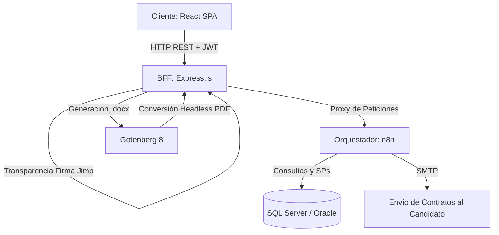

# ¡Hola! Soy Andrés Felipe Orozco González 👋
### Ingeniero en Sistemas | Analista de Desarrollo Tecnológico

  
  
  
  
  
  
  

---

## 🚀 Sobre Mí

Soy **Ingeniero en Sistemas** con pasión por construir soluciones de software eficientes, automatizar flujos de trabajo corporativos complejos e integrar tecnologías que impacten positivamente el rendimiento del negocio. 

Actualmente me desempeño como **Analista de Desarrollo Tecnológico** en **Autobuses el Poblado Laureles - APL**, liderando proyectos de transformación digital, desarrollo full-stack y optimización de infraestructura. Me especializo en:

*   💻 **Desarrollo Full-Stack:** Creación de aplicaciones robustas usando React, TypeScript, Node.js y Express.js.
*   ⚙️ **Automatización & Orquestación:** Diseño de flujos de trabajo empresariales mediante **n8n** y **Power Automate** para conectar servicios de bases de datos y APIs.
*   🗄️ **Bases de Datos Relacionales:** Modelado y optimización de consultas/procedimientos almacenados en **SQL Server** y **Oracle**.
*   🐳 **DevOps e Infraestructura:** Despliegue de aplicaciones contenerizadas y orquestadas mediante Docker.
*   🤖 **Inteligencia Artificial Aplicada:** Integración de herramientas de IA y LLMs mediante Prompt Engineering avanzado para optimizar tareas cotidianas.

---

## 🛠️ Mi Stack Tecnológico

| Categoría | Tecnologías y Herramientas |
| :--- | :--- |
| **Lenguajes** | C#, Python, Java, JavaScript, TypeScript, HTML5, CSS3, SQL, PL/SQL |
| **Frontend** | React, TypeScript, CSS Vanilla (Responsivo, Mobile-First) |
| **Backend & BFF** | Node.js, Express.js, JWT Authentication, API RESTful |
| **Base de Datos** | SQL Server (T-SQL), Oracle Database, MySQL |
| **Orquestación & IA** | n8n (Webhooks, SQL Nodes), Power Automate, Prompt Engineering |
| **Herramientas & DevOps** | Git, Docker, Docker Compose, Gotenberg 8 (Generador PDF), VS Code |
| **Soporte & Redes** | Redes TCP/IP, LAN/WLAN, Mantenimiento preventivo/correctivo de computadores |

---

## 💼 Portafolio de Proyectos Destacados

### 1️⃣ Sistema Corporativo E2E de Onboarding (APL - 2025)
Digitalización y automatización integral de la incorporación de conductores y personal administrativo, logrando una **reducción del 80% en tiempos operativos** y la eliminación total del papel físico.

*   **Tecnologías:** React, TypeScript, Node.js, Express, n8n, SQL Server, Gotenberg, Docker, WebRTC.
*   **Módulo Biométrico:** Implementación de captura fotográfica por webcam en tiempo real y firmas manuscritas digitalizadas en Canvas.
*   **Seguridad:** BFF (Backend-for-Frontend) con autenticación basada en JWT a través de cookies HttpOnly seguras.
*   **Despliegue:** Empaquetado de todo el ecosistema (Frontend, Backend, Gotenberg, BD) en contenedores de producción auto-recuperables.

### 2️⃣ Plataforma de Seguimiento Legal y Contractual (TIGO - 2022)
Sistema web interno desarrollado para la gestión de contratos tecnológicos y control de casos legales.
*   **Tecnologías:** PHP, JavaScript, HTML/CSS, MySQL.
*   **Logro:** Centralizó más de 500 registros de contratos tecnológicos de la compañía, reduciendo en un 40% el tiempo de búsqueda y auditoría de documentos legales.

### 3️⃣ Ecosistema de Automatizaciones Administrativas (APL - 2025)
Diseño de flujos de trabajo interdepartamentales automáticos.
*   **Tecnologías:** Power Automate, SQL Server, Microsoft Office Suite.
*   **Logro:** Automatización del flujo de aprobación y registro de información, conectando bases de datos SQL transaccionales con notificaciones en tiempo real, erradicando tareas repetitivas de entrada de datos.

---

## 🏆 Certificaciones y Educación Continua

*   🎓 **Especialización Google Prompting Essentials** — Coursera / Google (2025)
*   💻 **Certificado Profesional en Soporte TI de Google** — Coursera / Google (2025)
*   🗣️ **Desarrollo de Inglés (Nivel B1)** — Instituto Tecnológico Metropolitano (ITM) (2018 - 2019)
*   ⚙️ **Técnica en Sistemas** — SENA (2012 - 2013)

---

## 🧠 Habilidades Blandas & Metodologías
*   **Aprendizaje Autodidacta:** Capacidad para asimilar rápidamente nuevas tecnologías y lenguajes.
*   **Resolución Analítica de Problemas:** Enfoque lógico orientado a la eficiencia de procesos.
*   **Trabajo en Equipo e Interdepartamental:** Experiencia coordinando flujos de trabajo con áreas legales, operativas y de recursos humanos.
*   **Metodologías de Desarrollo:** Control de versiones Git, GitFlow y buenas prácticas de desarrollo ágil.

---

## 🏆 Mis Trofeos de GitHub

  

---

## 📈 Mis Estadísticas de GitHub

  
  

---

## 📬 Conectemos

*   💼 **LinkedIn:** [Andrés Orozco](https://www.linkedin.com/in/andresfelipeorozcogonzalez/)
*   📧 **Email:** [andres.thebad@gmail.com](mailto:andres.thebad@gmail.com)
*   📍 **Ubicación:** Medellín, Colombia 🇨🇴

---
> *"Apasionado por transformar líneas de código en soluciones reales que simplifiquen la vida de las personas e impulsen la eficiencia de los negocios."*
