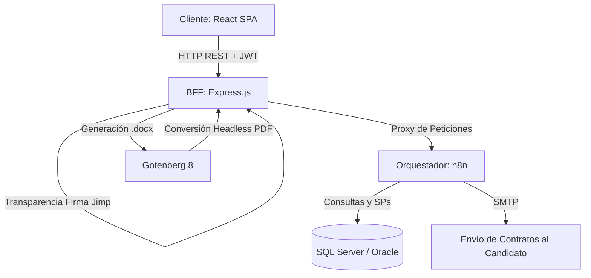

# ¡Hola! Soy Andrés Felipe Orozco González 👋
### Tecnólogo en Sistemas | Analista de Desarrollo Tecnológico

  
  
  
  
  
  
  

---

## 🚀 Sobre Mí

Soy **Tecnólogo en Sistemas** con pasión por construir soluciones de software eficientes, automatizar flujos de trabajo corporativos complejos e integrar tecnologías que impacten positivamente el rendimiento del negocio. 

Actualmente me desempeño como **Analista de Desarrollo Tecnológico** en **Autobuses el Poblado Laureles - APL**, donde lidero proyectos de digitalización e infraestructura, especializándome en:

*   💻 **Desarrollo Full-Stack:** Creación de aplicaciones robustas usando React, TypeScript, Node.js y Express.js.
*   ⚙️ **Automatización & Orquestación:** Diseño de flujos de trabajo empresariales mediante **n8n** y **Power Automate** para conectar servicios de bases de datos y APIs.
*   🗄️ **Bases de Datos Relacionales:** Modelado y optimización de consultas/procedimientos almacenados en **SQL Server** y **Oracle**.
*   🐳 **DevOps e Infraestructura:** Despliegue de aplicaciones contenerizadas y orquestadas mediante Docker.

---

## 🛠️ Mi Stack Tecnológico

| Categoría | Tecnologías |
| :--- | :--- |
| **Lenguajes** | C#, Python, Java, JavaScript, TypeScript, HTML5, CSS3, SQL, PL/SQL |
| **Frontend** | React, TypeScript, CSS Vanilla (Responsivo, Mobile-First) |
| **Backend & BFF** | Node.js, Express.js, JWT Authentication, API Restfull |
| **Base de Datos** | SQL Server (T-SQL), Oracle Database, MySQL |
| **Orquestación & IA** | n8n (Webhooks, SQL Nodes), Power Automate, Prompt Engineering |
| **Herramientas & DevOps** | Git, Docker, Docker Compose, Gotenberg 8 (Generador PDF), VS Code |

---

## 📂 Proyecto Destacado

### 📋 Sistema Corporativo E2E de Onboarding (APL)
Desarrollé y desplegué en producción un ecosistema digital completo para la incorporación de conductores y personal administrativo, logrando una **reducción del 80% en tiempos operativos** y la eliminación del papeleo físico.

#### Características del Proyecto:
*   **Biometría WebRTC:** Módulo para la captura de fotografía desde webcam e inyección dinámica en plantillas de Word.
*   **Firma Digital Canvas:** Captura de trazos vectoriales para firmas de contratos directamente en pantallas táctiles o mouse.
*   **Seguridad:** BFF seguro con JWT mediante cookies HttpOnly firmadas.
*   **DevOps:** Ecosistema portable distribuido y empaquetado en contenedores Docker y persistencia auto-recuperable contra fallos del disco.

---

## 📈 Mis Estadísticas de GitHub

  
  

---

## 📬 Conectemos

*   💼 **LinkedIn:** [linkedin.com/in/andrés-orozco-76bb85237/](https://www.linkedin.com/in/andrés-orozco-76bb85237/)
*   📧 **Email:** [andres.thebad@gmail.com](mailto:andres.thebad@gmail.com)
*   📍 **Ubicación:** Medellín, Colombia 🇨🇴

---
*(Nota: Recuerda cambiar `TU_USUARIO_AQUÍ` en la sección de estadísticas por tu nombre de usuario real de GitHub).*
